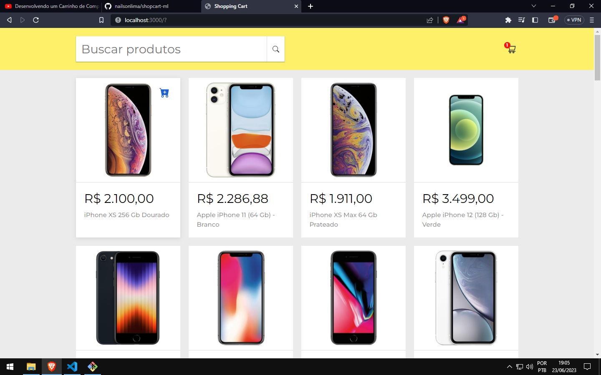
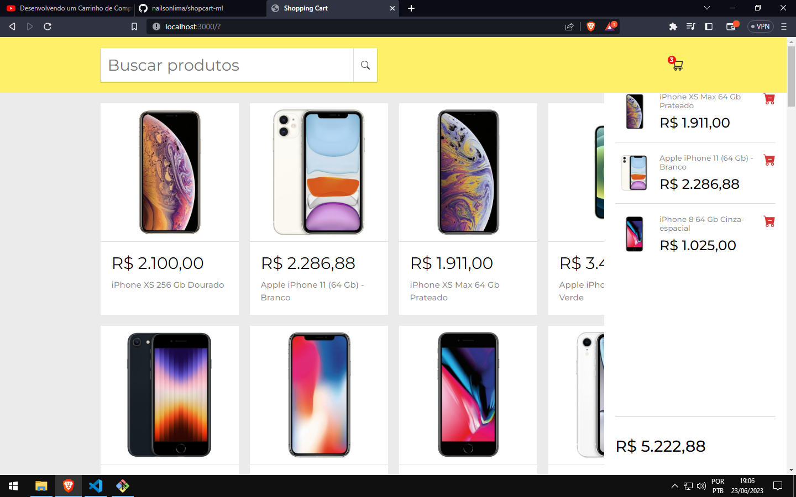

# 🛒 shopcart using the mercado livre api
🛒projeto feito com auxilio da api do mercado livre📁 

## 🛠️ Construído com:

* [ReactJS](https://pt-br.reactjs.org/) - O framework web usado

## ✒️ Autores

* **Nailson** - [desenvolvedor](https://github.com/nailsonlima)

## 🎁 Expressões de gratidão

* Obrigado pelo seu tempo e apoio!
* Espero ter sido útil!❤

---
Feito com ❤️ por [Nailson Lima](https://gist.github.com/nailsonlima) 😊
